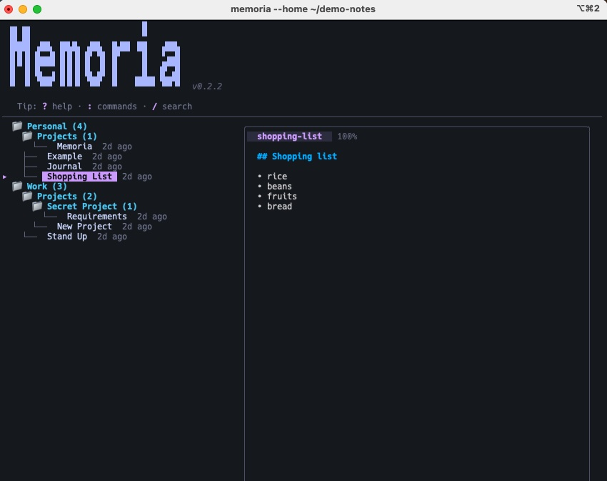

# memoria

[](https://github.com/cassiomarques/memoria/actions/workflows/ci.yaml)
[](https://github.com/cassiomarques/memoria/actions/workflows/release.yaml)

A terminal-based note-taking app with full-text search, automatic git sync, editor integration and other niceties. 

Memoria keeps your notes as plain Markdown files organized in folders, indexes them for instant search, and automatically syncs everything to a git remote. Edit with your favourite editor, navigate with vim keybindings.



## Features

- **Plain Markdown** — Notes are `.md` files with YAML frontmatter. 
- **Full-text search** — Powered by [Bleve](https://blevesearch.com/). Fuzzy, typo-tolerant, instant.
- **Automatic git sync** — Every create, edit, delete, move, and tag change is committed and pushed.
- **Folder hierarchy** — Organize notes in nested folders. Collapsible tree view in the TUI.
- **Tagging** — Add and remove tags at any time. Search and filter by tag.
- **Your editor** — Opens `$EDITOR` (or vim) for editing. Memoria handles the rest.
- **Beautiful TUI** — Catppuccin Mocha theme, markdown preview, vim-style navigation.
- **Single binary** — Pure Go, no CGO, no external dependencies.

## Installation

### Homebrew (macOS & Linux)

```bash
brew install cassiomarques/tap/memoria
```

### Go install

```bash
go install github.com/cassiomarques/memoria/cmd/memoria@latest
```

### From source

```bash
git clone https://github.com/cassiomarques/memoria.git
cd memoria
make build
# Binary is in bin/memoria
```

### GitHub Releases

Pre-built binaries for macOS and Linux (amd64 & arm64) are available on the [Releases](https://github.com/cassiomarques/memoria/releases) page.

## Quick start

```bash
# Launch the TUI
memoria

# On first run, memoria creates:
#   ~/.memoria/config.yaml    — configuration
#   ~/.memoria/notes/          — your notes (git repo)
#   ~/.memoria/meta.db         — metadata (SQLite)
#   ~/.memoria/search.bleve/   — search index
```

### Using a custom home directory

Use `--home` to run memoria with a completely isolated data directory:

```bash
# Great for demos, testing, or separate note collections
memoria --home ~/demo-notes
```

This creates config, notes, database, and search index all under `~/demo-notes/` instead of `~/.memoria/`.

### Set up git sync (optional but recommended)

Create a private repository on GitHub (or any git host), then inside memoria:

```
:remote git@github.com:youruser/my-notes.git
```

From this point on, every change is automatically committed and pushed.

### Create your first note

```
:new ideas/my-first-note
```

This creates `ideas/my-first-note.md` and opens it in your editor. When you save and close, memoria indexes it and syncs to git.

## Keybindings

| Key | Action |
|-----|--------|
| **j / k** or **↑ / ↓** | Navigate the note tree |
| **h / l** or **← / →** | Collapse / expand folder |
| **Enter** | Open selected note in editor (or toggle folder) |
| **p** | Toggle markdown preview for selected note |
| **e** | Edit note from preview (when preview is focused) |
| **Tab** | Switch focus between tree and preview |
| **n** | Create a new note in the focused folder |
| **d** | Delete selected note or folder (with confirmation) |
| **:** | Open command bar |
| **/** | Search / filter notes |
| **?** | Show help |
| **Esc** | Close preview / help / command bar |
| **q** | Close preview/help if open, otherwise quit |
| **Ctrl+C** | Quit immediately |

### Search syntax

Press `/` to start searching. Type your query, press **Enter** to lock results and browse them with normal keybindings, press **Esc** to clear.

| Pattern | Meaning |
|---------|---------|
| `foo` | Fuzzy match "foo" in title, path, folder, tags, and content |
| `foo bar` | Match "foo" **AND** "bar" (both must match) |
| `"exact phrase"` | Match exact phrase (substring) |
| `#tag` | Filter by tag name |
| `foo #work` | Match "foo" AND notes tagged "work" |

### Navigation extras

| Key | Action |
|-----|--------|
| **g g** | Jump to top of list |
| **G** | Jump to bottom of list |
| **Ctrl+d** | Page down |
| **Ctrl+u** | Page up |

## Commands

Type `:` to open the command bar. Tab completion is available for paths, folders, and tags.

| Command | Usage | Description |
|---------|-------|-------------|
| `new` | `:new <path> [tag1 tag2...]` | Create a note and open in editor |
| `open` | `:open <path>` | Open an existing note |
| `search` | `:search <query>` | Full-text search across all notes |
| `tag` | `:tag <path> <tag1> [tag2...]` | Add tags to a note |
| `untag` | `:untag <path> <tag1> [tag2...]` | Remove tags from a note |
| `ls` | `:ls [folder]` | List notes (optionally in a folder) |
| `cd` | `:cd [folder]` | Change folder context (`/` for root) |
| `mv` | `:mv <old> <new>` | Move or rename a note |
| `rm` | `:rm <path>` | Delete a note |
| `tags` | `:tags` | Show all tags with note counts |
| `todo` | `:todo <title> [#tag] [@due(YYYY-MM-DD)] [--folder <path>]` | Create a todo note |
| `todos` | `:todos` | Show all todos sorted by due date |
| `sync` | `:sync` | Pull from remote and reload all notes |
| `remote` | `:remote <git-url>` | Configure git remote |
| `fixfm` | `:fixfm` | Add frontmatter to notes missing it |
| `help` | `:help` | Show help |
| `quit` | `:quit` | Exit memoria |

## Configuration

Config lives at `~/.memoria/config.yaml`:

```yaml
# Directory where notes are stored (supports ~ expansion)
notes_dir: ~/.memoria/notes

# Git remote URL (set via :remote command)
git_remote: ""

# Editor command (leave empty to use $EDITOR, $VISUAL, or vim)
editor: ""

# Start with all folders expanded (default: true)
expand_folders: true

# Show the virtual "Pinned" section at the top of the tree (default: true)
show_pinned_notes: true

# Show modification timestamps next to notes (default: true, toggle with t)
show_timestamps: true

# Default folder for todos created with :todo (default: "TODO")
default_todo_folder: "TODO"

# Enable/disable todo features (default: true)
todos_enabled: true
```

### Editor resolution

Memoria picks your editor in this order:

1. `editor` field in config.yaml
2. `$EDITOR` environment variable
3. `$VISUAL` environment variable
4. `vim` (fallback)

Multi-word commands work too (e.g., `editor: emacs -nw`).

## How notes are stored

Each note is a Markdown file with YAML frontmatter:

```markdown
---
tags:
  - go
  - project
created: 2026-04-01T10:00:00Z
modified: 2026-04-02T15:30:00Z
---

# My Note

Content goes here...
```

### Todos

Todo notes have extra frontmatter fields:

```markdown
---
tags:
  - work
todo: true
done: false
due: 2026-04-15
created: 2026-04-07T12:00:00Z
modified: 2026-04-07T12:00:00Z
---

Details about the task...
```

Create todos with `:todo fix the auth bug #work @due(2026-04-15)`. Press **x** on a todo to toggle done/undone. Use `:todos` to see all todos sorted by due date. Overdue todos are shown in red, due-today in yellow, done items are dimmed.

Notes live in `~/.memoria/notes/` and can be nested in folders:

```
~/.memoria/notes/
├── work/
│   ├── meeting-notes.md
│   └── project-ideas.md
├── learning/
│   ├── go/
│   │   └── concurrency.md
│   └── rust/
│       └── ownership.md
└── daily.md
```

## Architecture

Memoria uses a three-layer storage design:

| Layer | Location | Purpose |
|-------|----------|---------|
| **Filesystem** | `~/.memoria/notes/` | Source of truth — plain Markdown files |
| **SQLite** | `~/.memoria/meta.db` | Fast metadata lookups, folder listing, tag queries |
| **Bleve** | `~/.memoria/search.bleve/` | Full-text search index |

All three stay in sync automatically. The Markdown files are what gets committed to git.

## Tech stack

- [Bubble Tea v2](https://github.com/charmbracelet/bubbletea) — TUI framework
- [Lip Gloss v2](https://github.com/charmbracelet/lipgloss) — Terminal styling
- [Glamour v2](https://github.com/charmbracelet/glamour) — Markdown rendering
- [Bleve v2](https://github.com/blevesearch/bleve) — Full-text search engine
- [go-git v5](https://github.com/go-git/go-git) — Pure Go git implementation
- [modernc.org/sqlite](https://pkg.go.dev/modernc.org/sqlite) — Pure Go SQLite
- [Catppuccin Mocha](https://github.com/catppuccin/catppuccin) — Color scheme

Everything is pure Go — no CGO, no system dependencies.

## Development

```bash
# Run tests (327 tests)
make test

# Run with race detector, short mode
make test-short

# Coverage report
make test-cover
open coverage.html

# Lint
make lint

# Build
make build

# Run directly
make run
```

## Releasing

Releases are automated with [GoReleaser](https://goreleaser.com/) via GitHub Actions:

```bash
git tag v0.2.0
git push --tags
```

This builds binaries for all platforms, creates a GitHub Release, and updates the Homebrew formula.

## License

[MIT](LICENSE)
